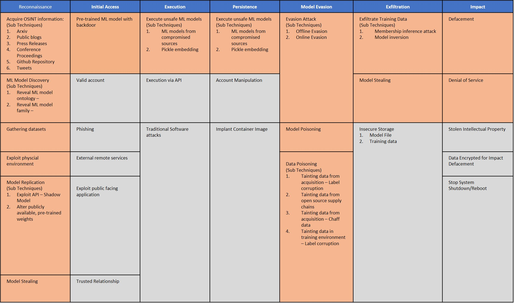

# Table of Contents
1. [Adversarial ML 101](/pages/adversarial-ml-101.md)
2. [Adversarial ML Threat Matrix](/pages/adversarial-ml-threat-matrix.md)
    - [Why Adversarial ML Threat Matrix?](#why-adversarial-ml-threat-matrix)
    - [Structure of Adversarial ML Threat Matrix](/pages/adversarial-ml-threat-matrix.md#Structure-of-Adversarial-ML-Threat-Matrix)
    - [Things to keep in mind before you use the framework](/pages/things-to-keep-in-mind-before-you-use-the-framework.md)
8. [Case Studies Page](/pages/case-studies-page.md)
    - [ClearviewAI Misconfiguration](/pages/case-studies-page.md#clearviewai-misconfiguration)
    - [GPT-2 Model Replication](/pages/case-studies-page.md#gpt-2-model-replication)
    - [ProofPoint Evasion](/pages/case-studies-page.md#proofpoint-evasion)
    - [Tay Poisoning](/pages/case-studies-page.md#tay-poisoning)
    - [Microsoft Red Team Exercise](/pages/case-studies-page.md#microsoft-red-team-exercise)
    - [Bosch Team Experience with EdgeAI ](/pages/case-studies-page.md#bosch-team-experience-with-edgeai)
    - [MITRE -- Physical Adversarial Attack](/pages/case-studies-page.md#mitre-physical-adversarial-examples-tbd)
5. [Contributors](#contributors)
6. [Feedback](#feedback-and-getting-involved)
6. [Contact Us](#contact-us)
---- 

The goal of this project is to position attacks on ML systems in an ATT&CK-style framework so that security analysts can orient themselves
in this new and upcoming threats.

If you are new to how ML systems can be attacked, we suggest starting at this no-frills [Adversarial ML 101](/pages/adversarial-ml-101.md) aimed at security analysts. 

Or if you want to dive right in, head to [Adversarial ML Threat Matrix](/pages/adversarial-ml-threat-matrix.md)

## Why Adversarial ML Threat Matrix? 
1.  In the last three years, major companies such as [Google](https://www.zdnet.com/article/googles-best-image-recognition-system-flummoxed-by-fakes/), [Amazon](https://www.fastcompany.com/90240975/alexa-can-be-hacked-by-chirping-birds), [Microsoft](https://www.theguardian.com/technology/2016/mar/24/tay-microsofts-ai-chatbot-gets-a-crash-course-in-racism-from-twitter), and [Tesla](https://spectrum.ieee.org/cars-that-think/transportation/self-driving/three-small-stickers-on-road-can-steer-tesla-autopilot-into-oncoming-lane), have had their ML systems tricked, evaded, or misled.
2.  This trend is only set to rise: According to [Gartner report](https://www.gartner.com/doc/3939991). 30% of cyberattacks by 2022 will involve data poisoning, model     theft or adversarial examples.
3.  However, industry is underprepared. In a [survey](https://arxiv.org/pdf/2002.05646.pdf) of 28 organizations spanning small as well as large organizations, 25           organizations did not know how to secure their ML systems.

Unlike traditional cybersecurity vulnerabilities that are tied to specific software and hardware systems, adversarial ML vulnerabilities are enabled by inherent limitations underlying ML algorithms. As a result, data can now be weaponized in new ways requiring that we extend the way we model cyber adversary behavior, reflecting emerging threat vectors and the rapidly evolving adversarial machine learning attack lifecycle.

This threat matrix came out of partnership with 12 industry and academic research groups with the goal of empowering security analysts to orient themselves in this new and upcoming threats. **We are seeding this framework with a curated set of vulnerabilities and adversary behaviors that Microsoft and MITRE have vetted to be effective against production ML systems** Since the primary audience is security analysts, we used ATT&CK as template to position attacks on ML systems given its popularity and wide adoption in the industry.

We recommend digging into [Adversarial ML Threat Matrix](/pages/adversarial-ml-threat-matrix.md) next

## Contributors

| **Organization**    | **Contributors**    |
| :---                | :---                |
| Microsoft           | Ram Shankar Siva Kumar, Hyrum Anderson, Will Pearce, Suzy Shapperle, Blake Strom, Madeline Carmichael, Matt Swann, Mark Russinovich, Nick Beede, Kathy Vu, Andi Comissioneru, Sharon Xia, Mario Goertzel, Jeffrey Snover, Derek Adam, Deepak Manohar, Bhairav Mehta, Peter Waxman, Abhishek Gupta, Ann Johnson, Andrew Paverd  |
| MITRE               | Mikel D. Rodriguez, Christina E Liaghati, Keith R. Manville, Michael R Krumdick, Josh Harguess |
| Bosch               | Manojkumar Parmar |
| IBM                 | Pin-Yu Chen       |
| NVIDIA              | David Reber Jr., Keith Kozo, Christopher Cottrell, Daniel Rohrer |
| Airbus              | Adam Wedgbury     |
| Deep Instinct       | Nadav Maman       |
| TwoSix              | David Slater      |
| University of Toronto | Adelin Travers, Jonas Guan, Nicolas Papernot |
| Cardiff University  | Pete Burnap |
| Software Engineering Institute/Carnegie Mellon University | Nathan M. VanHoudnos | 
| Berryville Institute of Machine Learning | Gary McGraw, Harold Figueroa, Victor Shepardson, Richie Bonett|

## Feedback and Getting Involved 

The Adversarial ML Threat Matrix is a first-cut attempt at collating a knowledge base of how ML systems can be attacked. We need your help to make it holistic and fill in the missing gaps!

**Corrections and Improvement**

-   For immediate corrections, please submit a Pull Request with suggested changes! We are excited to make this system better with you!
-   For a more hands on feedback session, we are partnering with Defcon's AI Village to open up the framework to all community members to get feedback and make it better. Current thinking is to have this event circa
Jan/Feb 2021.Please register [here](https://docs.google.com/forms/d/e/1FAIpQLSdqtuE0v7qBRsGUUWDrzUEenHCdv-HNP1IiLil67dgpXtHqQw/viewform) for the workshop for more hands on feedback session

**Contribute Case Studies**
We are especially excited for new case-studies! Before submitting a case-study, consider that the attack:
1.  Exploits one or more vulnerabilities that compromises the confidentiality, integrity or availability of ML system 
2.  The attack was against a *production, commercial* ML system. This can be on MLaaS like Amazon, Microsoft Azure, Google Cloud AI, IBM Watson etc; ML models on devices 
3.  You have permission to share the information. Please follow the proper channels before reporting a new attack and that you are practicing responsible disclosure.  

If you satisfy all the three criteria: Email <Ram.Shankar@microsoft.com> and <Mikel@mitre.org> with summary of the incident and Adversarial ML Threat Matrix mapping.

**Join our Mailing List**

- For discussions around Adversarial ML Threat Matrix, we invite everyone to join our Google Group [here](https://groups.google.com/forum/#!forum/advmlthreatmatrix/join)
- Note: Google Groups generally defaults to your personal email. If you would rather access this forum using your corporate email (as opposed to your gmail)
  - Open your browser in Incognito mode.
  - Once you sign up with your corporate, and complete captcha, you may get an error. Ignore it!
  - Also note, emails from Google Forums generally go to "Other"/"Spam" folder. So, you may want to create a rule to go into your inbox instead

 
 ## Contact Us
For corrections and improvement or to contribute a case study, see [Feedback](#feedback-and-getting-involved)

For questions/comments/discussion: 
-  Our public email group is advmlthreatmatrix@googlegroups.com. This emails all the members of the distribution group. 
-  For private discussion, please email: <Ram.Shankar@microsoft.com> and <Mikel@mitre.org>

